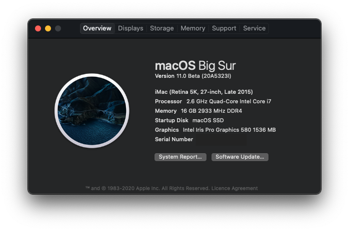

# intel-nuc6i7kyk-opencore

## What is this?
This repository tracks an OpenCore bootloader configuration for the Intel Skull Canyon NUC. 
This configuration was created by me with help from others (see credits) to allow the NUC to run macOS.
If you wish to try and run macOS on your Skull Canyon, you can start here.

This is for my own personal use, and as such I haven't tried to get every single thing working. 
If you know how to fix some things, feel free to raise an issue, fork and add a PR!

I've tried to keep a lot of this fairly stock and without too many kexts and manual patching, as I want this to be as close as possible to a real Mac.
OpenCore is great for this, hence why I use this over Clover.

Currently running: **macOS Big Sur Beta**

**Note:** This script requires a computer running macOS to run correctly, with Xcode+CLI tools installed from the App Store. Attempting to run on a non-Mac, or a Mac without Xcode
may not build the configuration in the right way and will most likely not boot.

## What works and what doesn't
What works:
* Booting
* Patched EC **(required for Catalina and up)**
* Intel WiFi (experimental, optional) 
* Graphics acceleration with Metal support (credit: WhateverGreen)
  * Some customised framebuffer patching included...
  * Iris Pro 580 with DVMT pre-alloc
  * HDMI 2.0 4k enabled and working
  * Multiple display support
  * No graphical glitching
  * Iris Pro 580 login screen bug on full screen video fixed (GPU device id spoofed to Intel HD 530)
  * Display hotplugging works
* Onboard audio (Realtek ALC233)
  * Enabled with AppleALC, `alcid=32`, no distortion/weirdness
* Native CPU/iGPU power management
  * Skylake, iMac17,1 SMBIOS
  * Custom CPU SSDT from `ssdtPRgen` and CPUFriend to dynamically patch X86PlatformPlugin
  * Idles at 0.8GHz *(not technically base freq of 500MHz for i7-6770HQ, but the NUC is plugged in all the time)*
* Bluetooth (credit to the kext: `IntelBluetoothFirmware`)
* Gigabit Ethernet (credit to the kext: `IntelMausiEthernet`)
* NVMe
* Full USB support (credit: RehabMan and his tutorial on creating a custom USB SSDT, USBInjectAll)
* Shutdown/reboot should be working correctly (no hang on shutdown with custom SSDT)
* iCloud/App Store/iMessage functionality (with a well-formed SMBIOS, see below)
* FileVault works fully with latest OpenCore

What doesn't (yet) work:
* Proper sleep (partially fixed with a182e791) - sleeps OK, wakes to black screen but power-cycling/hotplugging a display brings it back
* Thunderbolt 3 (may fix in future with an approach similar to Hades Canyon patches?)
  * Appears to work if the Thunderbolt device is connected at boot, but any hotplugging/sleep stops it from working
* SD card reader (PCIe, unlikely to ever work)
* TOSLINK optical jack (disabled in SSDT)
* Secure Boot (OpenCore should support this, just a case of enabling)

Known quirks:
* OpenCore applies custom ACPI patches to operating systems other than macOS
  * Hence, if you dual boot Windows/Linux, it may not be stable!
  * I use the boot manager to switch, although there is a fork of OpenCore that only selectively applies ACPI patching
  
## How to get started?
### BIOS configuration
Main things that you **must** do here are:
* Disable Intel Virtualization Technology for Directed IO (VT-d)
  * I don't believe macOS supports this
  * You *can* still boot if you need VT-d turned on, just add `dart=0` to boot flags
    * I'm assuming you know where that is if you're asking this question :P
* Disable Secure Boot
  * OpenCore technically supports this - I haven't found the time to setup yet
* Set `IGD Minimum Memory` to 64MB and `IGD Aperture Size` to 128/256MB

### Repository setup

**Note: The example config.plist includes null strings for SMBIOS values. Do not use this, it's unlikely to work correctly.**
  * I didn't want to make my personal SMBIOS values public (I'm signed into iCloud), but the setup script can generate a new one for you.

1. `git clone https://github.com/alexpotter1/intel-nuc6i7kyk-opencore`
2. `cd intel-nuc6i7kyk-opencore`
3. `chmod +x ./setup.sh && ./setup.sh`

Note: If you have an OpenCore `config.plist` you'd like to use, specify this with `./setup.sh -f <path-to-plist>`
  * This may be because you've already configured an SMBIOS
  * **The example config does not include an SMBIOS**
    * Best to make your own one, the setup scripts do this for you! (credit: GenSMBIOS by CorpNewt)

#### If you're generating an SMBIOS
* Follow the steps with GenSMBIOS
* Install `macserial` first if you haven't (press 1?)
* Tell the script where the default config.plist is (`EFI/OC/config.plist`)
* Generate an SMBIOS (use `iMac17,1`, **important!**)
* Generate a UUID
* Quit

4. The script should download new versions of the kexts used into `EFI/OC/Kexts`
  * I didn't include them in the repo as they get outdated fast, best to get latest versions
5. Run `chmod +x ./export.sh && sudo ./export.sh` to copy the EFI to your EFI System Partition **(as root)**
  * To do this, you need to know where your EFI partition is - **make sure you get the right one to avoid data loss!**
  * `diskutil list`, find the right disk
  * Then tell the script which partition is your EFI partition
    * If you're creating a USB, make sure you use the USB's EFI partition (e.g. `disk4s1`)
    * If you're installing to the current hard drive's EFI partition **(caution!)**, use `disk0s1`

#### If you want WiFi
When performing setup, the script will ask you if you want to enable Intel WiFi support (disabled by default). Type 'y' to enable.

After macOS installation, to get the companion app 'HeliPort' working:
1. Mount your EFI with `sudo diskutil mount /dev/disk0s1`
2. Go to `/Volumes/EFI/EFI/OC` (your root OpenCore folder)
3. Copy `HeliPort.app` to `/Applications`
4. Open the app. It should be in your menu bar. Enable `Launch at Login` is recommended.

Full credit to this goes to zxystd/OpenIntelWireless for this work.  
**Note:** I will not provide support for this kext, it is provided as-is and should **not** be considered production-ready. Contact the developer for support.
    
## Credits
Some people who were invaluable in helping me get setup, whether through informative forum posts, kexts, or custom ACPI SSDTs:
* RehabMan - his comprehensive thread for Mojave and the NUC6i7KYK on [tonymacx86.com](https://www.tonymacx86.com/threads/guide-intel-skylake-nuc6-and-skull-canyon-using-clover-uefi-nuc6i5syk-nuc6i7kyk-etc.261708/)
* [acidanthera](https://github.com/acidanthera) - for OpenCore, WhateverGreen, Lilu, AppleALC, NVMeFix, VirtualSMC, probably more
* [This OpenCore Vanilla guide - Skylake](https://khronokernel-2.gitbook.io/opencore-vanilla-desktop-guide/)
* [zxystd](https://github.com/zxystd/IntelBluetoothFirmware) for his awesome Intel Bluetooth firmware/Intel WiFi kexts
* [Mieze](https://github.com/Mieze/IntelMausiEthernet) for the amazing Intel Ethernet kext, without this, the NUC is kinda useless
* [CorpNewt](https://github.com/CorpNewt) for the very nice GenSMBIOS tool, and Lilu-and-Friends used to help get kexts
* [Piker-Alpha](https://github.com/Piker-Alpha/) for `ssdtPRgen.sh` to create a custom SSDT for power management
* Probably many more talented hackintosh community members who I've missed when researching for hours and hours
  * Please let me know if I didn't include you - absences are completely accidental, promise :P

